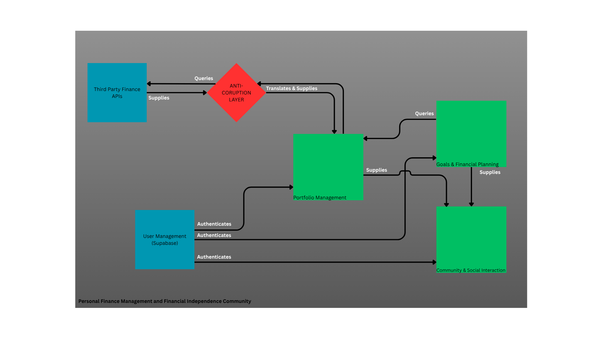
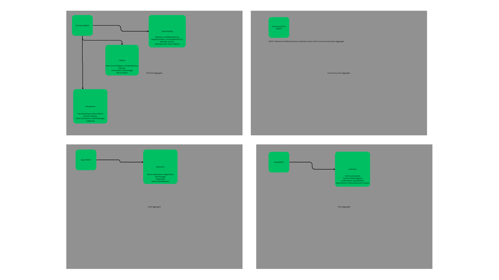

# Project Documentation

*Author: D3rrickLa*

*Version: 0.0.3*

## Summary

FortuneLink is a social and personal portfolio platform to both trackc your finance and interact with a community dedicated to the FIRE movement. Whether you are new to your journey or an experienced DIY investor, FortuneLink is here for anyone that wants to take their finances seriously. 

Our main target audience will be those between 18 - 45, as through own observation, that is the age range where people have disposable income, but might not have the knowledge on what to do with it. We are different from platforms like Reddit and Twitter (aka X), where too many bad or misinformed information is spread like gosspel. The community will hold itself accountable self-moderating itself (in addition to common reporting tools and automated flagging) and ensuring that everyone can learn in a safe and informative way. We are here to make your financial journey the top priority through a more transparent and engaging alternative. While interacting with others, we also want you to see how you are doing and if you are on track to reach your goals. Our application stands out with a detailed portfolio breakdown and milestone system to not only track your progress, but also see how long and how much more you need to invest for financial freedom.

What is financial freedom? That depends on the user, but from what we see, it resembles some variation of FIRE, (Financial Independence, Retire Early). Many might be shooting for the stars and want to have millions save while other just want to feel financially stable. The choice is yours, but no matter what, the community and application will make that dream a reality.

## Approach to Development

The entire development of this application will follow a Domain-Driven Design approach. Not only will this be a learning experience for me, the designer/developer, but also encourage collaboration between domain experts (i.e. financial advisors/investors) and us technical people. The core idea of DDD is based on the domain we are speaking in, we can have the same 'ubiquitous language' for better and effective communication.

When using DDD, focus on the most *CRITICAL* parts of the application - the core domains. This will help us be more focused with our development and with other key concepts like bounded context (explicit boundaries within a domain model, helping prevent conflicts and misunderstanding when working on larger systems), Entities and Value Objects (distinct identities defined by their attributes vs. objects defined by their attributes but without a distinct identity - money, dates, geo-coordinates) or Aggregates (clusters of related Entities and or Value Objects, treated as a single unit). We can design a scalible system that will meet our needs and grow with the project. As a side note, we will be starting with a modular monolith architecture as a micro-service is not needed currently given the size of the team and the expected user base.

An Example of this in action: 

*Imagine you're building a healthcare software system. In this complex domain, you might define separate Bounded Contexts for Patient Records, Billing, and Medical Procedures. Each context will have its own understanding of terms like "Patient" and "Invoice," tailored to its specific needs.*

### Extra Information

Choosing between Entities, Value Objects, and Aggregates depends on your domain's needs:

- Use Entities for objects with a distinct identity that changes over time.
- Use Value Objects for concepts without identity where immutability and consistency are essential.
- Use Aggregates to group related objects and enforce transactional consistency.

Other quick info:
- Domains - real business problems (e.g. E commerce, Payroll System)
- Sub Domains - A focused smaller part of the problems (e.g. E commerce has many sub domains such as Shopping Cart, Billing, Product Catalog, Customer Information, etc.)
    - core sub domains - these are what make your business unqiue and competitive
    - supporting sub domains - necessary for your business but don't provide a competitive advantage, you might build them in-house
    - generic sub domains - common problems that have off-the-shelf solutions (e.g. identity management, email sending)
- Anti-Corruption Layer (ACL) - meant to clean incoming and outgoing data between two context

The inspiration/application design and logic will include features from the following apps:
- Ghostfolio/TradingView (Portfolio management aspect)
- Reddit/Blossom Soical (socializing)
- Portfolio Visualizer (Back Testing and What-if scenarios)

Analogy: Building a House
Imagine you're building a house (your Overall Domain).

The subdomains are the different functional areas you need:

Kitchen (cooking food)
Bathroom (personal hygiene)
Bedroom (sleeping)
Living Room (socializing/entertainment)
Utility Room (heating, plumbing)
Garage (car storage)

The Bounded Contexts are the walls you build around each of these areas.

The "Kitchen Context" has its own specific tools (stove, fridge), rules (no shoes on the counter!), and language ("sauté," "bake").
The "Bathroom Context" has its own tools (toilet, shower), rules (flush!), and language ("shampoo," "soap").
While they are all part of the same house, the rules and tools are distinct within their own contexts. You wouldn't typically find a toilet in the kitchen!

## Context Map Diagram

*Domains*

- Personal Finance Management and Financial Independence Community

*Sub Domains*

- Portfolio Management
- Goals & Financial Planning
- Community & Social Interaction

## Bounded Context Details

- Portfolio Management Bounded Context
- Goal & Financial Planning Bounded Context
- Community & Social Bounded Context

## Ubiquitous Language Glossary

technically, these can changed based on the context: User can have many meaning depending on if you are talking about Auth Users or Community & Social Users

User (General / Authentication Context): An individual registered on FortuneLink, primarily defined by their authentication credentials (e.g., email, password) and basic profile information managed by the core platform. This is the overarching identity.

- Note on Context: While the User represents the same individual across contexts, their attributes and behaviors are understood differently within specific Bounded Contexts. For example, a User in the Portfolio Management Context will have Assets and Goals, whereas in the Community & Social Context, they will have Posts and Comments.

Portfolio: A collection of a User's financial assets and liabilities.

- Context: Primarily used within the Portfolio Management Bounded Context.

Asset: Something a User owns that has value (e.g., stocks, bonds, real estate, cash, etc.).

- Context: Primarily used within the Portfolio Management Bounded Context.

Account: The specific type or name in which an Asset is held or from which transactions occur (e.g., Non-Registered, Tax-Free Savings Account (TFSA), Registered Retirement Savings Plan (RRSP), Investment Account, Chequing Account).

- Context: Primarily used within the Portfolio Management Bounded Context.

Transaction: A financial event that alters a Portfolio's composition or value (e.g., buy, sell, deposit, withdrawal, dividend income, interest received, liability payment).

- Context: Primarily used within the Portfolio Management Bounded Context.

Liability: A debt or financial obligation a User owes (e.g., mortgage, student loan, credit card debt).

- Context: Primarily used within the Portfolio Management Bounded Context.

Goal: A specific financial objective a User aims to achieve (e.g., "Save for Down Payment," "Retire by 50").

- Context: Primarily used within the Goals & Financial Planning Bounded Context.

Milestone: A significant interim achievement or sub-target on the path to a larger Goal.

- Context: Primarily used within the Goals & Financial Planning Bounded Context.

FIRE Number: The specific financial target a User defines as sufficient for Financial Independence, typically calculated based on desired annual expenses and a safe withdrawal rate.

- Context: Primarily used within the Goals & Financial Planning Bounded Context.

Investment Strategy: The predefined approach or philosophy a User takes to investing their Portfolio (e.g., "Dividend Growth," "Index Fund Investing," "Value Investing").

- Context: Primarily used within the Goals & Financial Planning Bounded Context (when planning) and Portfolio Management Bounded Context (when analyzing alignment).

Contribution: Funds regularly or irregularly added by a User to their Portfolio or specific Accounts to increase their capital.

- Context: Primarily used within the Portfolio Management Bounded Context and Goals & Financial Planning Bounded Context.

Withdrawal: Funds removed by a User from their Portfolio or specific Accounts.

- Context: Primarily used within the Portfolio Management Bounded Context and Goals & Financial Planning Bounded Context.

Net Worth: The total value of a User's Assets minus their Total Liabilities.

- Context: Primarily used within the Portfolio Management Bounded Context.

Financial Freedom: The state where a User's passive income (or accumulated capital) covers their living expenses, allowing for choice over traditional work. This is the ultimate aspiration supported by the platform.

- Context: Overarching concept, particularly central to the Goals & Financial Planning Bounded Context.

Community (Platform): The social environment or platform where Users interact and share financial insights.

- Context: Primarily used within the Community & Social Interaction Bounded Context.

Member (Community & Social Context): A User who actively participates in the Community by posting, commenting, or reacting. This emphasizes their social identity within FortuneLink.

- Context: Primarily used within the Community & Social Interaction Bounded Context.

Post: A piece of content (text, image, link) shared by a Member in the Community.

- Context: Primarily used within the Community & Social Interaction Bounded Context.

Comment: A textual response made by a Member to a Post or another Comment within a discussion thread.

- Context: Primarily used within the Community & Social Interaction Bounded Context.

Reaction: An expression of sentiment by a Member towards a Post or Comment (e.g., upvote, downvote, helpful, like).

- Context: Primarily used within the Community & Social Interaction Bounded Context.

## Domain Use Cases
### Portfolio Management Bounded Context

Record New Asset Purchase:

- Description: A user buys a new financial asset (e.g., stock, crypto, bond) and records the transaction, quantity, price, and date in their portfolio.
- Trigger: User inputs transaction details.

Record Asset Sale:

- Description: A user sells a portion or all of an existing asset holding, recording the sale price, quantity, and date. The system calculates realized gain/loss.
- Trigger: User inputs transaction details.

Record Deposit to Cash Account:

- Description: A user adds cash to their portfolio.
- Trigger: User inputs deposit details.

Record Withdrawal from Cash Account:

- Description: A user removes cash from their portfolio.
- Trigger: User inputs withdrawal details.

Record Income (Dividend/Interest):

- Description: A user records passive income received from an asset holding (e.g., stock dividend, bond interest).
- Trigger: User inputs income details.

### Loan Management Bounded Context

Add New Liability:

- Description: A user records a new debt (e.g., mortgage, student loan) to track their overall financial obligations.
- Trigger: User inputs liability details.

Record Liability Payment:

- Description: A user records a payment made towards a liability, reducing the outstanding balance.
- Trigger: User inputs payment details.

### Goals & Financial Planning Bounded Context

View Current Net Worth:

- Description: The system calculates and displays the user's current net worth based on all recorded assets (at current market prices) and liabilities.
- Trigger: User accesses dashboard/summary.

View Portfolio Performance:

- Description: The system displays performance metrics (e.g., total return, annualized return, realized/unrealized gain/loss) for the portfolio over a selected period.
- Trigger: User selects performance report.

Analyze Asset Allocation:

- Description: The system visualizes the distribution of assets by type, sector, or geography within the portfolio.
- Trigger: User accesses allocation view.

Define a New Financial Goal:

- Description: A user creates a new goal, specifying its name, target amount, and optional target date.
- Trigger: User initiates goal creation.

Define FIRE Number & Assumptions:

- Description: A user inputs their desired annual expenses and a safe withdrawal rate to calculate their personal FIRE number. They can also set inflation assumptions.
- Trigger: User accesses the FIRE planning section.

Add Milestone to a Goal:

- Description: A user breaks down a larger goal into smaller, achievable milestones with specific target values or dates.
- Trigger: User adds a milestone to an existing goal.

View Goal Progress:

- Description: The system displays the current progress of a goal or milestone, comparing current portfolio value (queried from Portfolio Management) against the target.
- Trigger: User views a specific goal's details or a goal summary.

Run Financial Projection:

- Description: The system forecasts when a user might reach a goal or their FIRE number, based on current portfolio value, ongoing contributions, and investment assumptions.
- Trigger: User initiates a projection.

Run "What-If" Scenario:

- Description: A user modifies assumptions (e.g., increased savings, different returns) to see how it impacts their goal achievement date or required contribution.
- Trigger: User adjusts scenario parameters.

Mark Milestone/Goal as Achieved:

- Description: A user explicitly marks a milestone or goal as complete.
- Trigger: User indicates achievement (or system automatically detects via integration with Portfolio data).

Get Required Contribution for Goal:

- Description: The system calculates the regular amount a user needs to save/invest to reach a specific goal by a target date.
- Trigger: User requests contribution advice.

### Community & Social Interaction Bounded Context

Create New Post:

- Description: A user writes and publishes a new post to a specific forum or topic. This can be a standard text post, an image, a link, or a special post triggered by achieving a financial milestone.
- Trigger: User inputs post content.

Add Comment to Post/Reply:

- Description: A user responds to an existing post or another comment within a thread.
- Trigger: User inputs comment content.

React to Post/Comment:

- Description: A user expresses sentiment towards a post or comment (e.g., upvote, downvote, like, mark as helpful).
- Trigger: User clicks a reaction button.

Report Inappropriate Content:

- Description: A user flags a post or comment for moderation review due to violation of community rules.
- Trigger: User initiates a report.

View Feed:

- Description: The system displays a personalized stream of posts based on user preferences, followed forums, or trending content.
- Trigger: User navigates to their main feed or a specific forum.

Manage User Profile (Social Aspect):

- Description: A user updates their display name, avatar, bio, and other public-facing social information.
- Trigger: User accesses their profile settings.

Moderate Content/Users (for Moderators):

- Description: A moderator reviews reported content, applies rules, and manages user statuses (e.g., suspension, ban).
- Trigger: Moderator accesses moderation tools.

### User and Authentication Bounded Context
Basically we are handling the authentication, sign up, etc. here.
It's an external service (Supabase) that other contexts integrates with 

### Market Data
a canonical source for asset information (individually and or list) which include
prices, sectors, descriptions, and other market-related data. this will be consumed by other contexts (key lang: Price, Sector, Exchange, MarketCap, etc.)

## Aggregate Design Diagram

## Domain Model Diagrams
)
)
)

## Risk

### Cost

In terms of cost, I really don't want to spend that much money, as in I don't want to end up as that one Vercel user with a 100k bill at the end of the month. We can mitigate this by using free tier solutions, hence the use of supabase for the DB (no idea for actual hosting), but if this does become popular, the project would need a way to generate income for the servers and other unforseen application cost. Additionally would need a domain promotion down the line, but I don't think that is necessary, at least at the time of writing this...

Will probably consider AWS as I want to acutally learn the platform and get a AWS cert. If it does become popular, ad hosting and optional subscription for premium features

### Competition

The main competition I see with this application are Ghostfolio, WealthFolio, Blossom, and Reddit. The first 2 already have an active fandbase and strong set of features at hand which means that competing against them would be difficult. Blossom and Reddit are techinically competitors in terms of the social aspect as they have community built around finance. Addition competitors not listed are Portfolio tracking website that already exist. The way to get around the competition, at least in my mind, is easy of use - at least for the portfolio side. The portolfio applications I mentioned before, I have used and while I like the design, some have limited features and are clusmy to import data, at least for the average consumer. I would be focusing on UX for the most part. As for the others... Blossom in its marketing, has 250K+ users with Reddit probably 1 billion+ users.

The Blossom application would be the main inspiration and I would like to expand on some of their concepts would be the goal of this project.

### Third Party Limitations

A huge limitation I faced from my previous project was the APIs. TMDB does not have access to the streaming service links where said movie is located. This might happen with the APIs I would be using to get the stock data (haven't decided yet). These limitations could mean that in the rare case I can monitize this application - BIG IF, I would need to upgrade to their commerical API or swap it out entirely due to their TOS. We can mitigate this by building modular API services so we can swap out the data easily, or just find 1 good API we can use.

I have found 3 APIs that have peaked my intrest and will do more research into them
    1. Yahoo API
    2. Alpha Vantage
    3. FinnHub

### Scope/Feasibility

I am asking myself to build 2 systems really. A fourms platform and a portfolio tracking platform. As personally experienced in the last project I did, Streamsage, I scope creep that thing so hard that in the end, I wasn't able to deliver what I wanted to in the beginning, while a good thing, has taught me that I shouldn't aim that high for the sun. The following things are what I am going to do/the project entails, any deviation from the original concept will be considered out of scope and will haunt me 3 weeks from now. We will NOT be implementing the preimum features seen in the read me document. ALSO, we are developing for the WEB first, then mobile, so don't think about mobile features just yet,

Portfolio tracking feature for logged in user (user handled via Supabase, mainly all data is via supabase)

Similar concept to Ghostfolio/Wealthfolio in terms of what I want to do
Track the following items:

- Stocks
- ETFS
- Crypto (done properly, there is a Issue in Ghostfolio about how the tracking is not right)
- Dividends / interest
- free cash
- Have a basic breakdown (e.g. region of the world, stocks vs free cash). Again use Ghostfolio and Blossom as a reference

An easy way to input multiple data, whether that be showing them a .csv template they can enter their data or when entering data into the website, we can do a button like - 'and new using previous ticker' and 'start new'

In addition to the portfolio tracker, we need to fourms thing. Look up how Blossom or reddit handles the data, for now we will just be supporting text based fourms with liking, replying (threads like and in the comment section) and hearting a comment. sharing a comment will be nice, but I don't know how to implement that just yet, we are going to move to mobile later so that might be an issue, but I'm sure the Android/IOS SDK have something for this...

The feasibility of this project is also a concern/risk. The last project, had used lots of external tools (i.e. AI, but I really want to stick to my roots and look up tutorials and other resources for learning, I am actively seeing myself lower my intelligence because of AI...) Joke-ish aside, I would like to complete this project within a fast timeframe, maybe 3-4 months. the last project started a bit wonky because I had to return my laptop, so that took about a month off which should have been a 1 month job. I am going to mitigate teh risk on the feasibility by actually sticking to a TODO plan with JIRA and using the issues tab for tracking my progress, not like before where I just had a TODO file in the project which I never update. There is also Projects in GitHub? could be a good way to track issues without the need for JIRA

Another feasibility that came to mind, algorithms for user content... How does Instagram know what I would like? My likes/saves/watch time. we would need metadata for each post.
- we could just do a 'most liked'/'trending' in the last 24 hours and consider a more personalized algorithm in the future

## Technologies 

### Frontend

- React / Next.js – Core framework for UI with server-side rendering support
- Tailwind CSS – Utility-first CSS framework for styling

### Backend 

- PostgreSQL – Primary relational database
- Redis – Used for caching community posts (image URLs stored externally)
- GraphQL – API communication between front end and back end
- REST - for MVP API
- Spring Boot - Back end framework for business layer and data handling

### DevOps

- Git
- GitHub – Version control repository
- GitHub Actions – CI/CD automation pipeline
- Docker – Containerization and deployment management

### Tools

- Canva – System block diagrams and visuals
- Figma – UI/UX design

## Dependencies

- Java JDK – Latest LTS (current or JDK 24, depending on stability)
- TypeScript – Typed JavaScript for frontend/backend logic
- Node.js – Runtime for Next.js and backend processing
- Supabase – Cloud storage for images, authentication, and database management
- Yahoo API / Other Financial Stock API – Market data for finance-related features
    1. Yahoo API
    2. Alpha Vantage
    3. FinnHub

## MVP - Minimum Viable Product

a set of features you *must* have for your first deployable version
1. portfolio tracking
2. User Account settings

social feature later on

DDD Layers
The idea is separation of concerns, isolating different parts of our system based on what they do.

Domain Layer
- brain and heart of the application, containg business logic, rules, and entities that define our domain - what the system is about
- no knowledge of outside systems like DB or frameworks. Should also be tested independently 

Application Layer
- the chef of this resturant. it know how to fulfill specific requests by orchestrating the business rules from the Domain layer
- we implement the use caes in the above doc

Infrastructure Layer
- utility room, handling the technical details and external connections. it knows how things are stored
- we will provide the concrete implementations for interfaces defined in the domain and app layer

--- 
This is the end of the Project Documentation.

